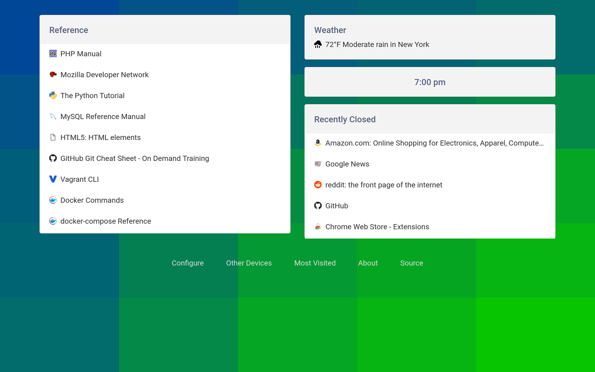
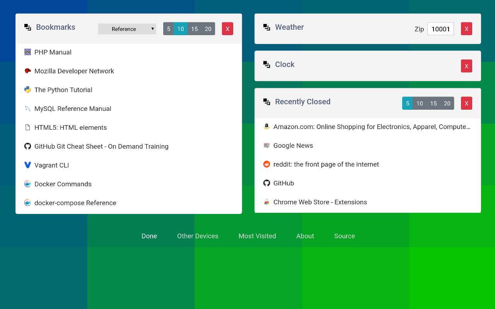

Chrome New Tab Cards Extension
==============================

[![Chrome Web Store][badge-cws]][link-cws]
[![Chrome Web Store Rating][badge-rating]][link-cws]

New Tab Cards is an extension for the Chrome browser.  It replaces the new tab page with minimalist, customizable card displays for most visited, bookmarks, recently closed, and more.

Install
-------

Distributed via the [Chrome Web Store](https://chrome.google.com/webstore/detail/new-tab-cards/idcpogancielddambnachkghlnjkfhci).

Or after cloning this repo:

    npm install

After downloading package dependencies this will run `postinstall.sh` and place the few necessary JS and CSS files into the `/src/vendor`.  This keeps the source directory clean for packaging the extension.

Sign up for an API key with OpenWeatherMap.org and paste it into `src/keys.js`.

Browse to `chrome://extensions/`, turn on developer mode, click "Load unpacked extension...", and choose the `src` directory.

Attribution
-----------

Weather data provided by [OpenWeatherMap.org](https://openweathermap.org/).

Contributors:
- [Nishant Kumar](https://github.com/nishant8BITS)

TODO
----

- A Chrome Apps launcher card
- Better weather icons
- Recently closed restore sessions

[badge-cws]: https://img.shields.io/chrome-web-store/v/idcpogancielddambnachkghlnjkfhci.svg?label=chrome
[link-cws]: https://chrome.google.com/webstore/detail/new-tab-cards/idcpogancielddambnachkghlnjkfhci "Published on Chrome Web Store"
[badge-rating]: https://img.shields.io/chrome-web-store/stars/idcpogancielddambnachkghlnjkfhci.svg
